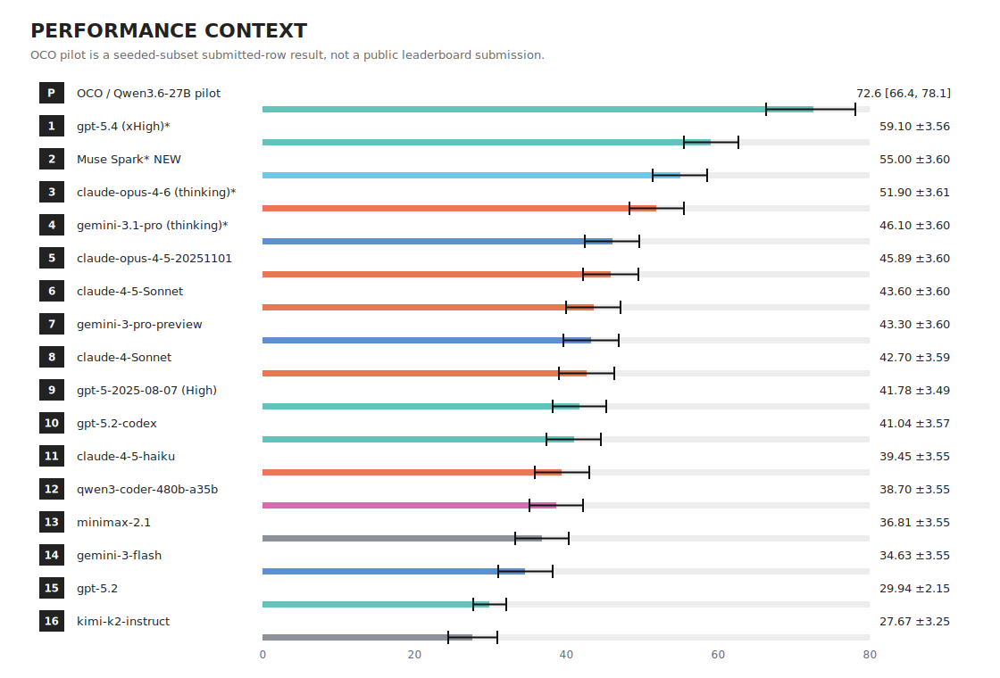
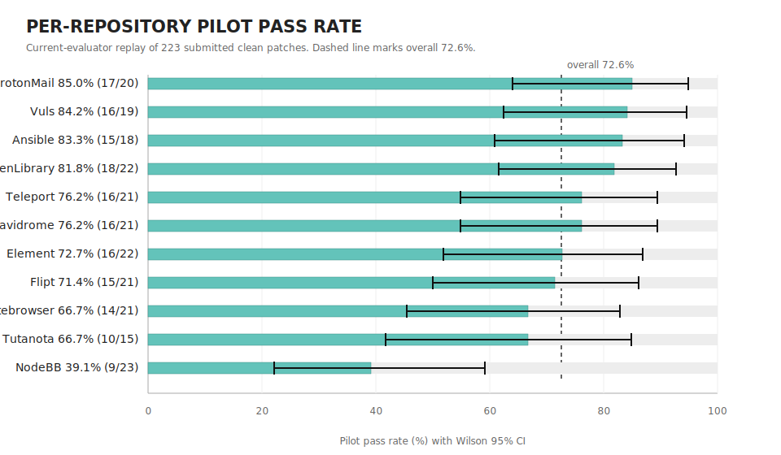
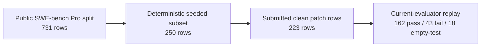

# OpenCodeOrchestra SWE-bench Pro Pilot

This repository is the public-facing benchmark artifact for evaluating **OpenCodeOrchestra (OCO)** on SWE-bench Pro with **Qwen3.6-27B**.

The central question is simple:

> **How much can a durable agent harness amplify an accessible open-weight model on a public repository-repair benchmark?**

OCO is an opencode-based workflow where a Project Manager agent frames the task, delegates implementation to a persistent Orchestrator, and can call specialist agents such as Investigator and Auditor. This benchmark repository is a **consumer** of OCO: it invokes an installed `oco` CLI, isolates each attempt, collects telemetry, prepares SWE-bench Pro evaluation bundles, and records methodology decisions.

This is an **engineering / ML-systems pilot**, not a public leaderboard submission.

## Start here

| If you want... | Read this |
|---|---|
| The polished paper | [`paper/main.pdf`](paper/main.pdf) |
| The result and denominator policy | [`docs/result-summary.md`](docs/result-summary.md) |
| The deployment-profile regression | [`docs/h200-fp8-mtp4-collapse.md`](docs/h200-fp8-mtp4-collapse.md) |
| The regression forensics | [`docs/current-vs-nvfp4-regression-forensics.md`](docs/current-vs-nvfp4-regression-forensics.md) |
| The Modal/evaluator runbook | [`docs/final-run-and-modal-eval-runbook.md`](docs/final-run-and-modal-eval-runbook.md) |

## Main result

The strongest positive result came from a **Runpod B200** seeded-subset pilot using **Qwen/Qwen3.6-27B-FP8** with **no speculative decoding**.

OCO resolved **162 tasks** in a **223-row submitted-patch replay** of a deterministic 250-task SWE-bench Pro seeded subset.

| Framing | Result | Wilson 95% CI | Use |
|---|---:|---:|---|
| **Strict submitted-row** | **162 / 223 = 72.6%** | **66.4%–78.1%** | Primary paper result. Counts all submitted rows. |
| Artifact-adjusted diagnostic | 162 / 219 = 74.0% | 67.8%–79.3% | Excludes only evaluator/tooling artifacts where the patch was not meaningfully tested. |
| Known-only diagnostic | 162 / 205 = 79.0% | 72.9%–84.0% | Optimistic diagnostic; excludes all empty-test outputs. |
| Conservative seeded-subset | 162 / 250 = 64.8% | 58.7%–70.5% | Treats non-submitted selected rows as non-pass. |

Recommended short phrasing:

> OCO with Qwen3.6-27B-FP8 on a non-speculative B200 serving profile resolved 162 tasks in a 223-row SWE-bench Pro seeded-subset pilot: **72.6% strict** over submitted evaluator rows, with an artifact-adjusted diagnostic score of **74.0%**.

Evidence note: earlier B200/NVFP4 experiments existed, and some legacy filenames still say `old-nvfp4`. The archived final methodology note for the 223-row submitted positive bundle records **B200, Qwen/Qwen3.6-27B-FP8, non-MTP**. This README follows that source-backed methodology record.

## Visual summary

### Performance context

The OCO pilot is shown against published SWE-bench Pro scores from Scale Labs for context. The OCO row is not a leaderboard submission because it uses a seeded-subset submitted-patch denominator.

### Per-repository replay results

The pilot was not uniform across repositories. NodeBB was the clear weak spot; most other repositories clustered near or above the overall result.

### Evidence chain

## Deployment-profile regression

A later full 731-task run used H200 hardware, FP8 serving, MTP-4 speculative decoding, and a newer standalone controller path. It generated non-empty patches for all 731 tasks, but official Modal evaluation produced:

| Run | Result | Interpretation |
|---|---:|---|
| B200 / FP8 / non-MTP pilot | 162 / 223 = 72.6% | Positive seeded-subset result. |
| H200 / FP8 / MTP-4 full run | 208 / 731 = 28.5% | Deployment-profile regression. |

This was not primarily an evaluator problem. Replaying the B200 patch bundle through the same later Modal/evaluator path reproduced the high result, while patch-level witnesses from the H200 run showed ordinary code-quality failures: undefined symbols, incomplete APIs, build failures, and semantic mismatches.

The systems lesson is direct: **throughput wins are not enough**. Serving and controller changes for long-horizon coding agents need task-level quality A/B tests.

## What is in this repository

| Path | Purpose |
|---|---|
| [`controller/`](controller/) | Benchmark controller: attempt lifecycle, OCO subprocess adapter, materializer, eval-bundle tooling. |
| [`scripts/`](scripts/) | CLI entry points for task materialization, benchmark launch, classification, and eval-bundle preparation. |
| [`docs/`](docs/) | Result summaries, methodology notes, runbooks, and forensic reports. |
| [`docs/assets/`](docs/assets/) | README-friendly visual summaries. |
| [`paper/`](paper/) | Technical-report source, compiled PDF, bibliography, and claims/threats companion note. |
| [`specs/`](specs/) | Historical implementation specs used while building the harness. |
| [`tests/`](tests/) | Unit tests for controller, materializer, telemetry, eval-bundle, and post-first-pass tooling. |

Large run artifacts are intentionally not committed to Git. A compact public artifact should include selected task IDs, submitted-row IDs, excluded-row reasons, per-row replay status, bundle hashes, and witness summaries.

## Reproduction requirements

- OCO 2.1.8+ installed and on `PATH`.
- Python 3.13+.
- A vLLM-compatible GPU serving a Qwen/OpenAI-compatible endpoint.
- Modal credentials for official SWE-bench Pro evaluation if using the Modal path.

Operational details from the completed run are in [`docs/final-run-and-modal-eval-runbook.md`](docs/final-run-and-modal-eval-runbook.md).

## Status

The current repository is a technical-report artifact. The next research step is a controlled harness-ablation study with matched baselines and serving-profile A/B tests.

## License

No open-source license file has been added yet. Until a license is chosen, reuse requires explicit permission.
